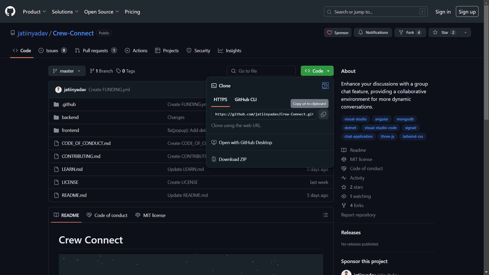
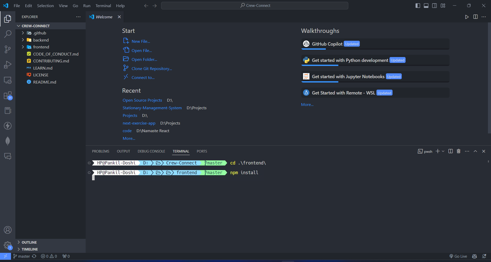
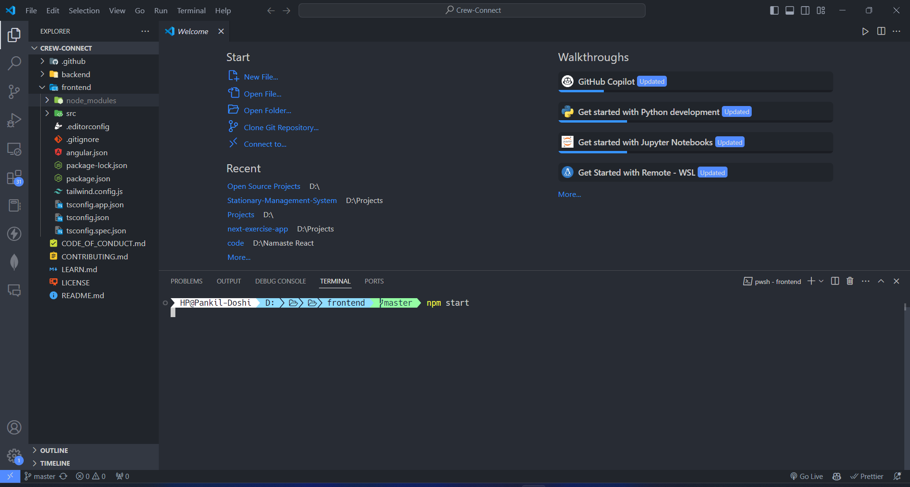
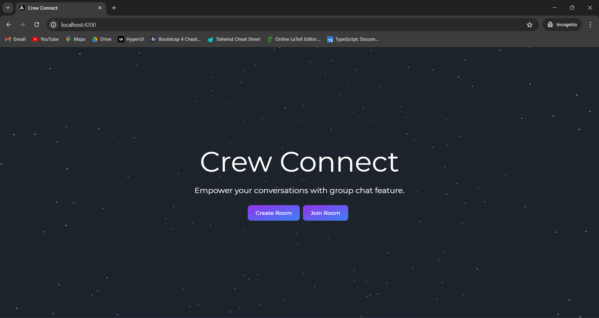
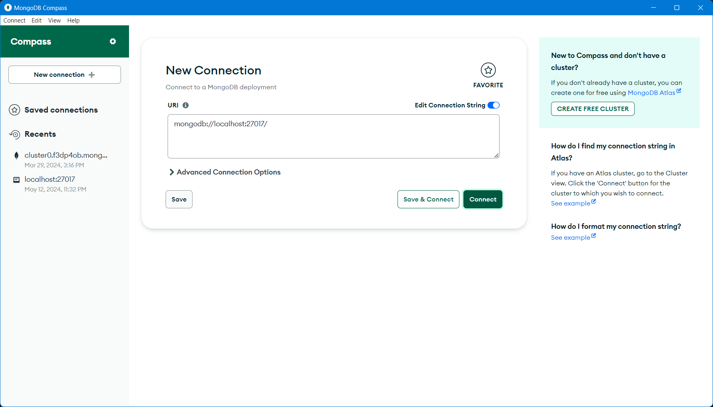
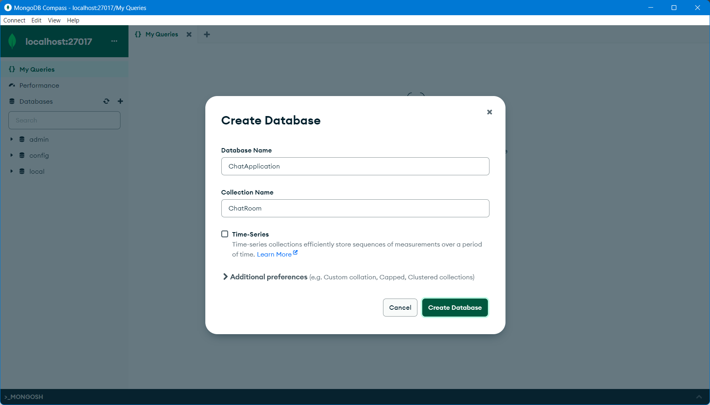
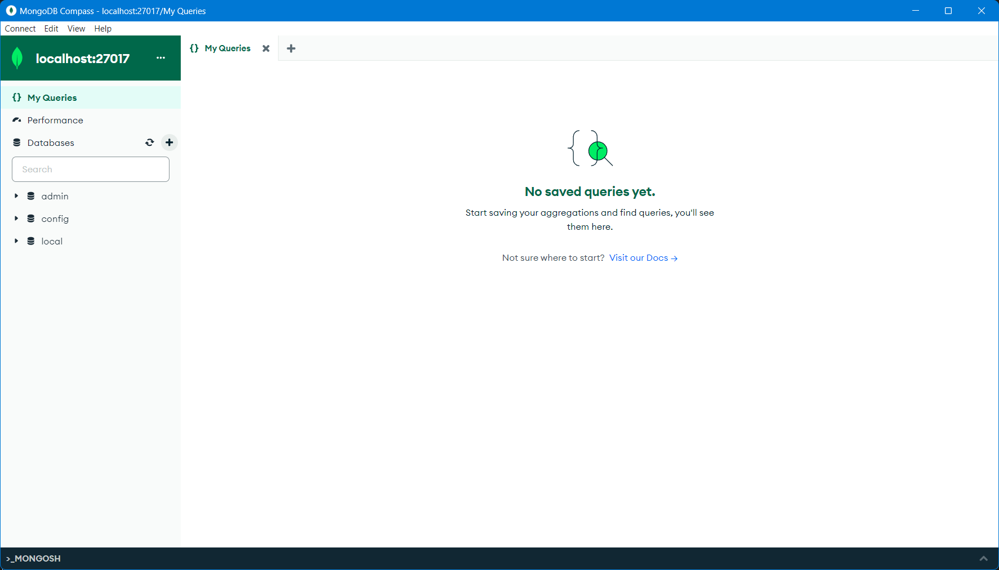
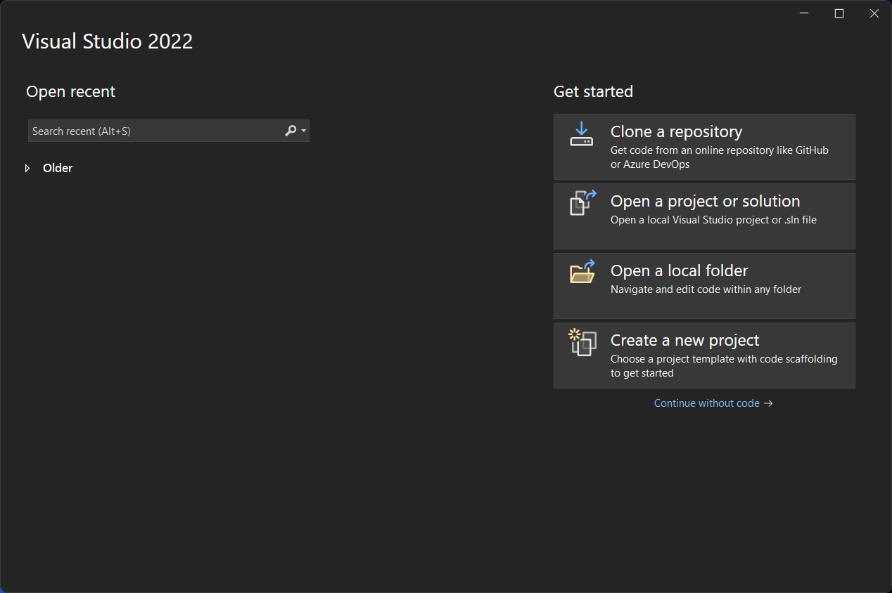
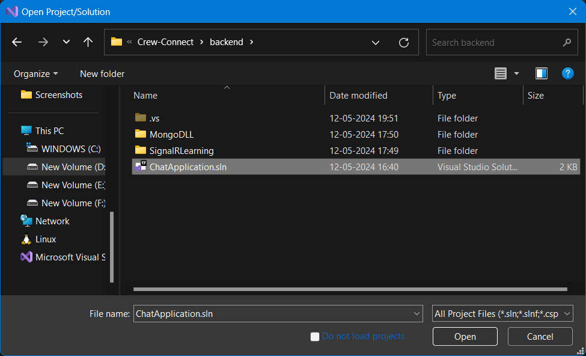
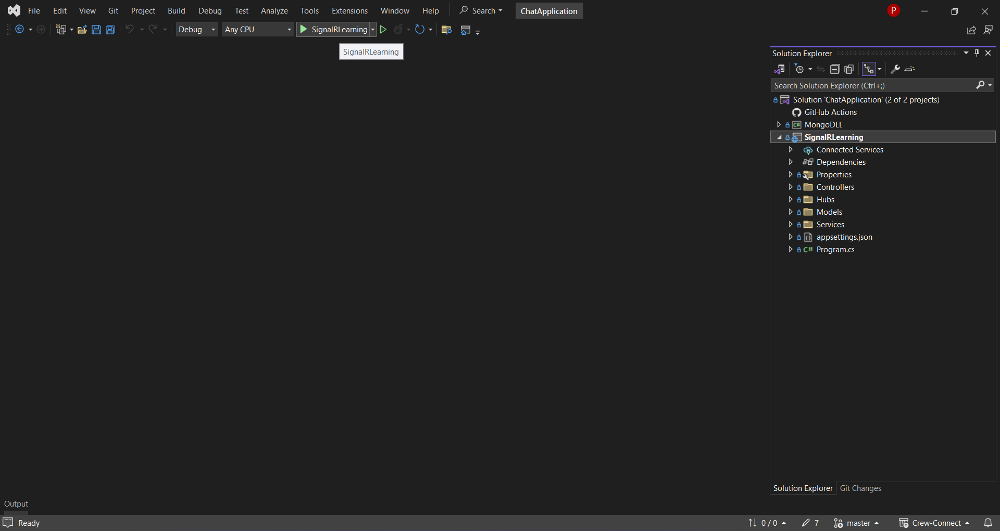

## Installation

# Installation

## Table of Contents
- [Required Tools](#required-tools)
- [Frontend Installation](#frontend-installation)
  - [1. Clone the Repository](#1-clone-the-repository)
  - [2. Open Project in Visual Studio Code](#2-open-project-in-visual-studio-code)
  - [3. Install Dependencies](#3-install-dependencies)
  - [4. Start Frontend](#4-start-frontend)
- [Backend Installation](#backend-installation)
  - [1. Connect MongoDB Compass](#1-connect-mongodb-compass)
  - [2. Create Database and Collection](#2-create-database-and-collection)
  - [3. Open Project in Visual Studio](#3-open-project-in-visual-studio)
  - [4. Load Solution](#4-load-solution)
  - [5. Start Debugging](#5-start-debugging)

#### Required Tools

Before proceeding with the installation, ensure that you have the necessary tools installed on your system. If any of these tools are missing, you can download and install them from the provided links:

- [Node.js](https://nodejs.org/en/download)
- [.NET 6](https://dotnet.microsoft.com/en-us/download/dotnet/thank-you/sdk-6.0.421-windows-x64-installer)
- [Visual Studio](https://code.visualstudio.com/Download)
- [Visual Studio Code](https://visualstudio.microsoft.com/downloads/)
- [MongoDB](https://www.mongodb.com/try/download/community)
- [MongoDB Compass](https://www.mongodb.com/try/download/compass)

Once you have all the required tools installed, you can proceed with the installation of the project.

### Frontend Installation

#### 1. Clone the Repository

Clone the Crew Connect repository from GitHub.
```bash
git clone https://github.com/jatiinyadav/Crew-Connect.git
```



#### 2. Open Project in Visual Studio Code

Navigate to the project directory and open it in Visual Studio Code.
```bash
cd Crew-Connect
code .
```


#### 3. Install Dependencies

Open the terminal in Visual Studio Code and navigate to the frontend directory. Then, install the dependencies.
```bash
cd frontend
npm install
```



#### 4. Start Frontend

To start the frontend, run the appropriate command.
```bash
npm start
```



The frontend of the application is now running and can be accessed at `http://localhost:4200/`.



### Backend Installation

#### 1. Connect MongoDB Compass

Open MongoDB Compass and connect to the MongoDB server at `mongodb://localhost:27017`.



#### 2. Create Database and Collection

Create a new database named `ChatApplication` and a collection named `ChatRoom`.






#### 3. Open Project in Visual Studio

Open Visual Studio and select "Open Project or Solution".



#### 4. Load Solution

Navigate to `<Project Directory>/Crew-Connect/backend/` and select the `ChatApplication.sln` file.



#### 5. Start Debugging

Once the solution is loaded, click on the "Start Debugging" button to run the backend of the application.



Your application is now ready to use.
